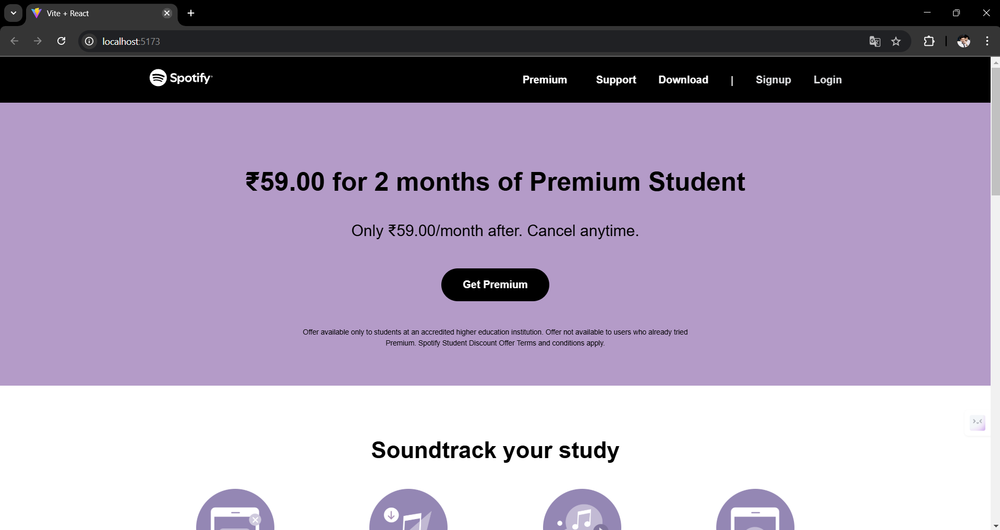
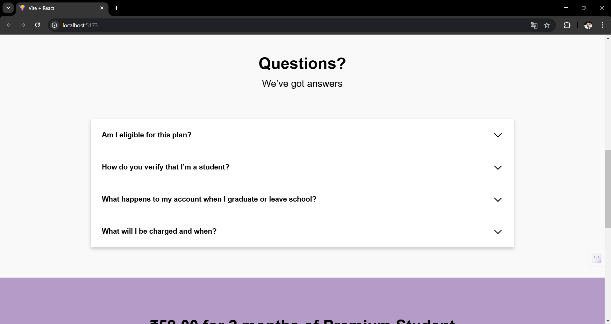
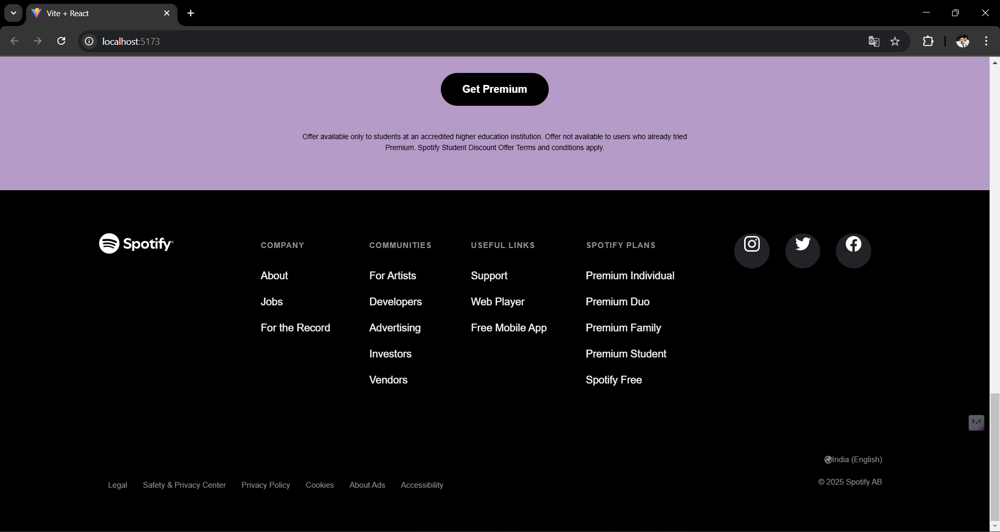

# Spotify Student Premium Clone

A complete React application that replicates the Spotify Premium for Students homepage. This project demonstrates how to build a single-page application that features promotional details and information relevant to Spotify’s student pricing.

## Table of Contents

- [Installation](#installation)
- [Usage](#usage)
- [Features](#features)

## Installation

To set up the project locally, follow these steps:

1. Clone the repository to your local machine:
   ```bash
   git clone https://github.com/yourusername/spotify-student-clone.git
2. Change to the project directory:
   ```bash
   cd spotify-studentpremium-clone
3. Install the necessary dependencies using npm or yarn:
   ```bash
   npm install
   # or
   yarn install

## Usage
To start the development server and view the application in your browser, run:
  ```bash
  npm run dev
  # or
  yarn run dev
  ```
Open your browser and go to http://localhost:3000 to see the Spotify Premium for Students homepage clone in action.

## Features
- Full replication of Spotify's Premium for Students promotional page using React
- Elegant and responsive design
- Information on pricing and benefits for students
- User-friendly interface and navigation

## Screenshots




